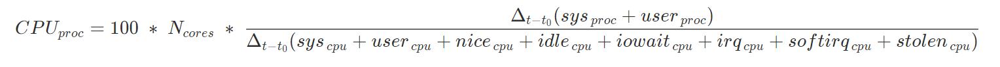
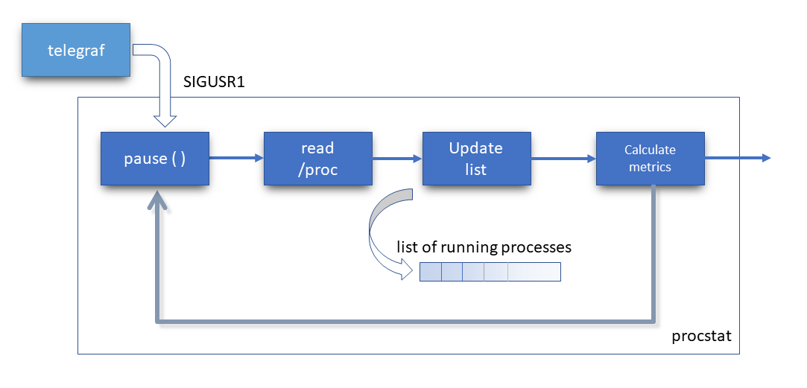

# procstat

procstat is a C/C++ alternative of the similar telegraf plugin, which however has a significantly smaller footprint on the system resources.

It monitors the running processes, about the CPU percentage and the memory that they consume, as well as metrics relating to the I/O traffic that they generate (read and written bytes per second, and CPU, block-io and swap-in delays). Refer to the taskstats kernel interface, for the definition of these delay accounting metrics.  

The processes' CPU is computed as the percentage of CPU time (jiffies) that was spent by the running process, during the sampling period, and versus the total time that the CPUs ran, during that time.

That is:




<!--
```math
CPU_{proc} =
100\; *\; N_{cores}  \; * \;\frac
{\Delta _{{t}-t_{0} }(sys_{\, proc} + user_{\, proc})}

{{\Delta _{{t}-t_{0} }(sys_{\, cpu} + user_{\, cpu} + nice_{\, cpu} + idle_{\, cpu} + iowait_{\, cpu} + irq_{\, cpu} + softirq_{\, cpu} + stolen_{\, cpu})}}
```
-->

Moreover, procstat provides the following features:
- **Display the N top consumers:** This will display the top-comsumer processes that actually take up system resources, and thus provide cleaner and more comprehensible reportings, as well as keep the cardinality of the influxDB sink to a low level. Ref. `environment.bucket_size`.
- **Filter by minimum values:** Processes of which the monitored metrics do not satisfy some minimum requirements will be filtered out. This is for the same purpose of cleaner reportings and influxDB cardinality control. Ref. environment.minCPU, `environment.minRSS`.
- **Aggregate multiple instances of same process:** Check if more than one processes have the same name (e.g. cases of multiple instances of the same executable, or forked process) and rename these processes by appending their names with a cardinal index (e.g. bash, bash_1, bash_2, etc.). Ref. `environment.aggregate`.
- **Monitor specific processes:** Apart from the top consumers, it is possible to monitor explicitly required processes. Ref. `environment.includeProcs`. 


## Configuration 
Add the following configuration in telegraf.conf. *Note*: `environment` options are also supported.  
```
[[inputs.execd]]
    # procstat_full_path: the full path of procstat executable
    command = ["procstat_full_path"]
    signal = "SIGUSR1"
    #restart_delay = "3s"

    environment = [
        # Aggregate similar running processes. Default: false 
        "aggregate=true",
        # Display N top consumers. Default: 5
        "bucket_size=5",
        # CPU threshold (0-100%, irix mode). Default: 3.0
        "minCPU=3",
        # Resident-Set-Size memory threshold (MB). Default: 20
        "minRSS=20",
        # Read and written bytes per second threshold (KB). Default: 5 MB/s
        "minIObytes=5000",
        # Delays per second threshold (msec). Default: 100 msec/s
        "minIOdelays=100",
        # Additional processes to track. Default: none
        "includeProcs=[telegraf, bash]"
    ]


```

## Under the hood

procstat runs as a deamon. It is paused in stand-by mode waiting for the receipt of a SIGUSR1 signal. Telegraf will send a SIGUSR1 signal, at its configured sampling period. Upon the arrival of the signal, a processing cycle will start that will scan all running processes, and read their needed metrics from /proc fs. Then a list of the running processes - together with their stats - is being dynamically updated. The latest process metrics are calculated and delivered back to telegraf for their further processing.



